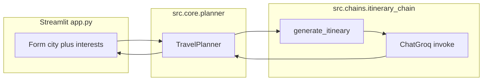

# AI Travel Assistant

A small **Streamlit** web app that generates a **day-trip itinerary** for a city you choose, tailored to **comma-separated interests**, using **LangChain** and **Groq** (`ChatGroq`).

---

## Table of contents

- [Features](#features)
- [Tech stack](#tech-stack)
- [Prerequisites](#prerequisites)
- [Configuration](#configuration)
- [Quick start (local)](#quick-start-local)
- [Project structure](#project-structure)
- [How it works](#how-it-works)
- [Logging](#logging)
- [Error handling](#error-handling)
- [Docker](#docker)
- [Kubernetes](#kubernetes)
- [ELK logging stack (Kubernetes)](#elk-logging-stack-kubernetes)
- [Troubleshooting](#troubleshooting)
- [Developer notes](#developer-notes)

---

## Features

- Web UI with a form: **city** + **interests** (comma-separated).
- On submit, calls a **Groq** LLM via LangChain to produce a **brief, bulleted** day-trip itinerary.
- **Structured Python package** under `src/` with logging to daily files under `logs/`.

---

## Tech stack

| Layer        | Technology |
|-------------|------------|
| UI          | [Streamlit](https://streamlit.io/) |
| LLM SDK     | [LangChain](https://python.langchain.com/) + `langchain_groq` (`ChatGroq`) |
| Config      | [python-dotenv](https://pypi.org/project/python-dotenv/) |
| Packaging   | `setuptools` (`setup.py`, editable install in Docker) |

Dependencies are listed in [`requirements.txt`](requirements.txt).

---

## Prerequisites

- **Python 3.10+** (Docker image uses `python:3.10-slim`).
- A **Groq API key** ([Groq Console](https://console.groq.com/)).

---

## Configuration

The app reads **`GROQ_API_KEY`** from the environment.

- [`app.py`](app.py) calls `load_dotenv()` so a local **`.env`** file is supported.
- [`src/config/config.py`](src/config/config.py) also calls `load_dotenv()` and sets `GROQ_API_KEY = os.getenv("GROQ_API_KEY")`, which [`src/chains/itinerary_chain.py`](src/chains/itinerary_chain.py) uses when constructing `ChatGroq`.

**Example `.env` (do not commit real keys):**

```env
GROQ_API_KEY=your_groq_api_key_here
```

`.env` is gitignored (see [`.gitignore`](.gitignore)).

---

## Quick start (local)

From the repository root:

```bash
python -m venv venv
source venv/bin/activate   # Windows: venv\Scripts\activate
pip install -r requirements.txt
# Optional: pip install -e .   # editable install (matches Dockerfile)
```

Set `GROQ_API_KEY` (or create `.env` as above), then:

```bash
streamlit run app.py
```

Open the URL Streamlit prints (default **http://localhost:8501**).

---

## Project structure

```text
.
├── app.py                 # Streamlit entrypoint (UI)
├── setup.py               # Package metadata; install_requires from requirements.txt
├── requirements.txt       # Runtime dependencies
├── Dockerfile             # Python 3.10 + editable install + Streamlit on port 8501
├── k8s-deployment.yaml    # Streamlit Deployment + LoadBalancer Service
├── elasticsearch.yaml     # ES in namespace `logging`
├── logstash.yaml          # Logstash + ConfigMap pipeline → Elasticsearch
├── filebeat.yaml          # Filebeat DaemonSet + RBAC in `logging`
├── kibana.yaml            # Kibana + NodePort service
└── src/
    ├── config/
    │   └── config.py      # GROQ_API_KEY from env / .env
    ├── chains/
    │   └── itinerary_chain.py   # ChatGroq, prompt, generate_itineary()
    ├── core/
    │   └── planner.py     # TravelPlanner orchestration
    └── utils/
        ├── logger.py      # File logging under logs/
        └── custom_exception.py
```

Package namespace markers (`__init__.py` files) exist under `src/` for a proper Python package layout.

---

## How it works

1. **UI** ([`app.py`](app.py)): `st.form` collects `city` and `interests`; on submit, both must be non-empty.
2. **Planner** ([`src/core/planner.py`](src/core/planner.py)): `TravelPlanner` stores city and splits interests on commas (strip whitespace), appends LangChain `HumanMessage`s, then calls `create_itineary()`.
3. **Chain** ([`src/chains/itinerary_chain.py`](src/chains/itinerary_chain.py)): `generate_itineary(city, interests)` formats a `ChatPromptTemplate`, invokes `ChatGroq` with model **`llama-3.3-70b-versatile`** and **`temperature=0.3`**, returns `response.content`.
4. **UI** renders the markdown itinerary.



---

## Logging

[`src/utils/logger.py`](src/utils/logger.py):

- Creates a **`logs/`** directory next to the working directory if missing.
- Writes to **`logs/log_YYYY-MM-DD.log`** (one file per calendar day).
- Uses `logging.basicConfig` with format `%(asctime)s - %(levelname)s - %(message)s` at **INFO**.

`TravelPlanner` logs key steps (init, set city/interests, generate itinerary).

---


## Docker

[`Dockerfile`](Dockerfile):

- Base: **`python:3.10-slim`**
- Installs **`build-essential`** and **`curl`**
- Copies the project and runs **`pip install --no-cache-dir -e .`**
- Exposes **`8501`**
- **CMD**: `streamlit run app.py --server.port=8501 --server.address=0.0.0.0 --server.headless=true`

**Build and run (pass the API key):**

```bash
docker build -t streamlit-app:latest .
docker run --rm -p 8501:8501 -e GROQ_API_KEY="your_key" streamlit-app:latest
```

Then open **http://localhost:8501**.

---

## Kubernetes

[`k8s-deployment.yaml`](k8s-deployment.yaml) defines:

- **Deployment** `streamlit-app`: image **`streamlit-app:latest`**, `imagePullPolicy: IfNotPresent`, container port **8501**.
- **Environment**: `envFrom` → **`secretRef.name: llmops-secrets`** (all keys in that Secret become env vars; include **`GROQ_API_KEY`**).
- **Service** `streamlit-service`: **LoadBalancer**, port **80** → targetPort **8501**.

**Example (after building and loading the image into your cluster, or using a registry):**

```bash
kubectl apply -f k8s-deployment.yaml
```

Create the secret first, for example:

```bash
kubectl create secret generic llmops-secrets \
  --from-literal=GROQ_API_KEY='your_key'
```

Adjust namespace and image pull policy if you push to a container registry.

### Kubernetes on a VM with Minikube (practical flow)

If you are running Kubernetes locally or on a VM via **Minikube**, use this practical sequence so the image is available to the cluster.

1. Start Minikube:

```bash
minikube start
```

2. Point Docker to Minikube’s Docker daemon, then build the app image:

```bash
eval $(minikube docker-env)
docker build -t streamlit-app:latest .
```

3. Create the API key Secret expected by `k8s-deployment.yaml`:

```bash
kubectl create secret generic llmops-secrets \
  --from-literal=GROQ_API_KEY='your_key'
```

4. Deploy the app to Minikube and check it’s running:

```bash
kubectl apply -f k8s-deployment.yaml
kubectl get pods
```

5. Expose the app:

Minikube often does not provide a real cloud `LoadBalancer`, so port-forward the Service:

```bash
kubectl port-forward svc/streamlit-service 8501:80 --address 0.0.0.0
```

Then open `http://<your-vm-ip>:8501` in your browser.

---

## ELK logging stack (Kubernetes)

Optional manifests ship a **logging** namespace stack for shipping container logs to Elasticsearch and viewing them in Kibana.

| File | Purpose |
|------|---------|
| [`elasticsearch.yaml`](elasticsearch.yaml) | PVC (2Gi), Elasticsearch **8.14.0** single-node, Service on **9200**, namespace **`logging`** |
| [`logstash.yaml`](logstash.yaml) | ConfigMap pipeline: Beats input **5044** → Elasticsearch at `http://elasticsearch.logging.svc.cluster.local:9200`, index `filebeat-%{+YYYY.MM.dd}` |
| [`filebeat.yaml`](filebeat.yaml) | Filebeat **DaemonSet**, container log paths, output to Logstash **5044**, RBAC + ServiceAccount |
| [`kibana.yaml`](kibana.yaml) | Kibana **7.17.0**, `ELASTICSEARCH_HOSTS=http://elasticsearch:9200`, Service **NodePort** **30601** |

**Notes:**

- Elasticsearch is **8.14.x** while Logstash/Kibana/Filebeat manifests use **7.17.x**; for production you should align major versions across the Elastic stack.
- Filebeat uses **hostPath** mounts (`/var/log`, `/var/lib/docker/containers`, registry under `/var/lib/filebeat-data`); ensure your cluster allows this.

**Suggested apply order:**

```bash
kubectl create namespace logging

kubectl apply -f elasticsearch.yaml
# Wait until Elasticsearch is ready.

kubectl apply -f logstash.yaml
kubectl apply -f filebeat.yaml
kubectl apply -f kibana.yaml
```

After each step, it’s helpful to verify resources:

```bash
kubectl get pods -n logging
kubectl get pvc -n logging
# PersistentVolumes are cluster-scoped; do not use `-n` here.
kubectl get pv
```

Access Kibana in one of two ways:

- Via NodePort (declared in `kibana.yaml`): `http://<node-ip>:30601`
- Via port-forward (handy when NodePort access is restricted):

```bash
kubectl port-forward -n logging svc/kibana 5601:5601 --address 0.0.0.0
```

Then open `http://<your-ip>:5601`.

### Kibana: create the Filebeat index pattern

1. Open Kibana: `http://<your-ip>:5601`
2. Click **Stack Management** (left sidebar)
3. Click **Index Patterns**
4. Create a new index pattern:
   - Pattern name: `filebeat-*`
   - Timestamp field: `@timestamp`
5. Click **Create index pattern**

### Explore logs

1. In the left panel, click **Analytics → Discover**
2. You should start seeing log events arriving from Filebeat.
3. Use filters like `kubernetes.container.name` to narrow down logs for a specific pod/container.

---

## Troubleshooting

| Issue | What to check |
|-------|----------------|
| **401 / invalid API key** | `GROQ_API_KEY` set correctly in shell, `.env`, or Kubernetes Secret `llmops-secrets`. |
| **Empty or failed LLM response** | Network egress; Groq service status; model name still available (`llama-3.3-70b-versatile` in code). |
| **Docker: port in use** | Change host mapping: `-p 8502:8501`. |
| **Streamlit shows traceback on submit** | Often missing key or LangChain/Groq error; check `logs/log_*.log` when running locally. |
| **K8s: ImagePullBackOff** | Build/tag `streamlit-app:latest` on the node or push to a registry and update the Deployment image. |
| **K8s: Pod has no `GROQ_API_KEY`** | Secret `llmops-secrets` must exist in the same namespace as the Deployment (default namespace unless you change the manifest). |

---

## Developer notes

- **Prompt and model**: Edit [`src/chains/itinerary_chain.py`](src/chains/itinerary_chain.py) — `itnineary_prompt`, `model_name`, `temperature`, and the `ChatGroq` constructor.
- **Orchestration / message history**: [`src/core/planner.py`](src/core/planner.py) — `TravelPlanner.messages` stores `HumanMessage` / `AIMessage` for possible future chat-style features.
- **Package name**: [`setup.py`](setup.py) uses `name="AI travel assistant"`; imports in code use the **`src`** layout (`from src.core.planner import ...`), so run the app from the repo root or an installed editable package with the same layout.

---
